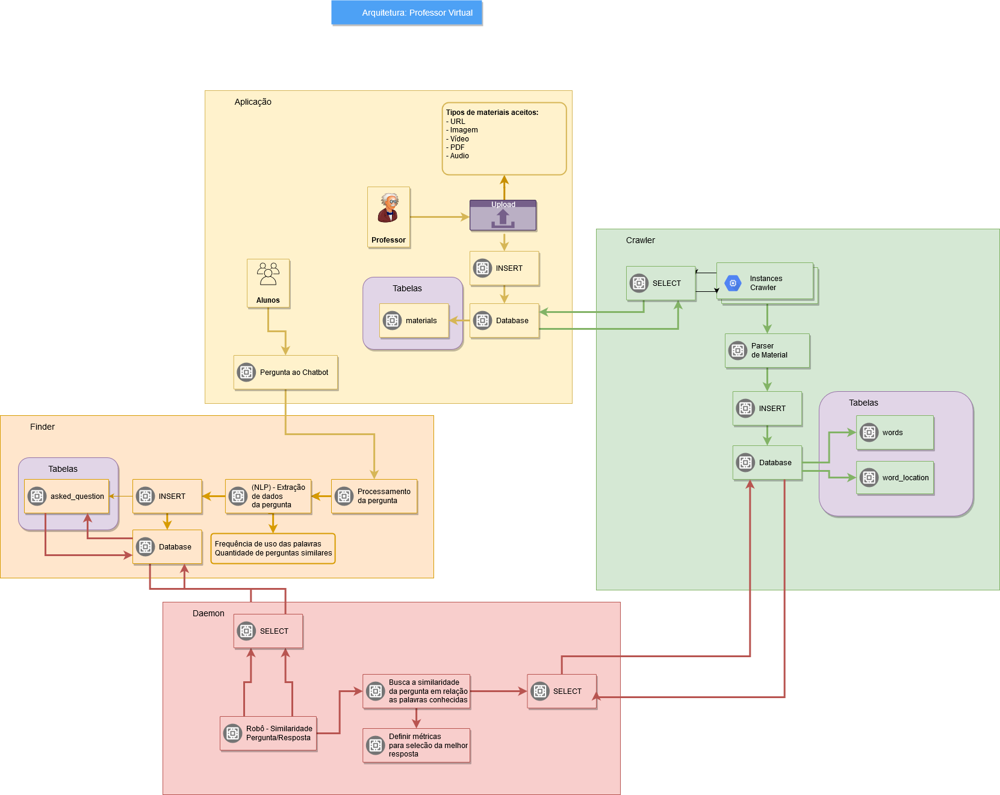

# profressor-virtual
[](https://github.com/FAST-PROJ/professor-virtual/blob/master/LICENSE)
[](http://makeapullrequest.com)

>Este repositório contém o código fonte do trabalho de conclusão de curso apresentado ao Centro Universitário Senac - Campus Santo Amaro.
O projeto tem por finalidade auxiliar professores na condução de aulas online.

[Arquitetura no draw-io](https://viewer.diagrams.net/?highlight=0000ff&edit=_blank&layers=1&nav=1&title=Arquitetura-Professor-Virtual.drawio#R7V1Zk%2BI4Ev41ROw%2BQPg%2BHikoZjuieqK2j9mZpwphC%2FC2sWjbVFXPrx%2FJlo1tyWAMPihMR3djWT5QpjK%2FTGWmRvJs%2B%2F6bD3abz8iG7kgS7PeRPB9JkqzKJv6PtPyKWyRRVOOWte%2FYcZt4aPjq%2FA1po0Bb944Ng1zHECE3dHb5Rgt5HrTCXBvwffSW77ZCbv6pO7CGTMNXC7hs6%2F8cO9zQVlEzDyf%2BA531hj7akPT4xBJYP9Y%2B2nv0eSNJXkWf%2BPQWJPeiPzTYABu9ZZrkx5E88xEK42%2Fb9xl0yeAmwxZftyg5m763D72w0gVKfMUrcPf0t8988OZCn75f%2BCsZk5XjujPkIj86lG0VGrYykh%2BC0Ec%2FYOaMIS1lTSNnkh8n4IMV8kJKaJFcBlxn7eEDF65C0ncHLMdbk7Okt%2FlI%2FuAvr9APHUyYKe0eot2h9zdyMB8rye3pywqHHk%2FR3ecKadqEW5fcH39lh4mOHHkcfM800WH7DaItDP1fuAs9qwmUhAmPK%2FT47cAwmk7bNhleSS8ElEnX6b0PhMJfKK34dAun67%2B94PXp0%2FfPzz%2F8%2FezT97E0FgVDZ8g53bl4%2FEYzeTTVo39lNJI0l4z5EhNZW4fReMQttvNabMJvkms9zhWY0yXL4nGFrS019Ra4gmEBDqOUcsVYzXOFyGEKkcMUqnQFpjBEgyW%2F%2F3PvhDDc%2B2AkT%2FG5Zx%2BtYBBgskjCH44f7oF7iqjKfCouVIaoHvJglp5kCNc%2BsB08VoU%2B1chMyaImjJHnKyJErz2JRS1PrrHImcWSyiGY0uAkNhiCQBurJ3qI%2FHCD1sgD7uOh9SHSOdCmfH7o84Si2UDG6%2F8wDH9RKoB9iPKjCd%2Bd8M%2FM97%2FIrSYqPZq%2F0ztHB7%2BSAw%2F%2F4j%2BzB5mryOHhsugoua6G0IjOJLpYTqlPBub4VMXjiPa%2BlQIMWeNzhA9dEDqv%2BbvxqEsvfUYOfk7KSbJZUAfFCR0Cfw1DelWBR9LXqMQ2yW%2FIzfNUpieSOjPPU0G%2BLBXj5SNfSqvstM%2BTR8zxIzkCywC5%2BxBOfSsRA6Q1PcKj%2BuCCJXSfUeCEDiKywcJ0xDDkIOyfCh22jm1HvJ9IE%2BaKRD0sURiiLSNoigqIvMXbBkvLr7gbaXnD8PZw1QO9S%2FS215VDKbckakNnxRAPS4gNYglV7lIMHUTPX5kzp8TQQfL8lRM8fRBDsQA4PuQlXHKhbFIUfSKpBbRq5O8SC8lriCf%2BbxMTJdoHdhJqsZN4gp0YtpnpxkIQGmcbUTHbYhvRlNplG0HTOmWbHBiSKqIhMSeE6GVHGKculFGU6pLlUha5UJnoPZr9x5UJO1fPd3y0QFDNaImgh7fKoc0iftyAHfm6fV8Tl%2BBkbe2kiY32Sxd%2BiRx0R0ardHyPI8wschN5KPC6EM0o%2BntMjYFoomawGE0zrkIEtRTyk4GIfKHJEGo%2F9yhG%2BbIQfbJNsQHwyQtC4FkwyFgH8X3y3h%2FWRVTnaalLseRZBWayQbBJpz118YJl6sTJ0LXAOqpoKAv5iKOC5dENfP9kEXPiYefHX%2BYW2u6wrfICvbUTXYj5JqQPLBopfkzn6jYK9XgULZS0X8EVMmI8IWb04VguHB4%2FTN3TbE7ZmojKIlsnd8lydeLivxBj5OHFWDSTxye3QKtVABvCFqp%2BK0qpO4fJUUulGvRQu4UeyaseVV%2Fduz%2FOV2cXOaoZf5Wus%2BpMVJLpmPNVa83RSmJo9en3r49fvl1PR%2Bgq%2BXOWjlgjtHbhiwfDN%2BT%2FeCFT6MUC1qZ3uoHq3zLdcIJhznRKHFEYssRRGFIjCqPAi02qC03pUl3k%2FfJ6Vcc87VnVh1FjkbdhRaNWVzQd27gqD6IPiqagaORkGnWraNgVlDnACgQEcFA13amaEqh4f6qm47UXqcbiy7lez%2B4cbUf1x03YNFqnlmtNKJLnD70Zr%2FgZtE3cIx0iBrMGYrjUb9p7xKAVYqhkQeoBYkgihTK0%2Bvr49DgbTNMO8UIJ4r87vKB3apq2EavRO7SQLOtUQAu61DFaYMNCBzUjGUnsO52wisgxTBVerG6DSoYHCJjQ7GfgB7nVNE7Ydq5JsLFVK3wGeBgdEu5bKbJ7UGNtqbGytfz7U2M3syDXO3WkS9XVUcfGa%2FKqgzrKqSNJm%2Bj5uadyskfaN3x0mSHXsCbXscYoQ5T3pzHqrLncoyxJsw67lSXDsksfpcmw7EIz71jza%2BHgqe4zzMms1kKtJCBLN5dxDsCHTnstrvKqKieBSeIY02laUwPSxrwZr1jv4vsSclYwJ8yOvVsm65hnkiGn7t5DwZAJ2Uom5EWSRCpG2VdLhDQalCI345S4jTzIKtKnujPD7NiZkbzqieSY7syJ84l7DTwgFTMHFQ4gEPVDt5YMEJN1ZjxDf733QkAeiPA%2Fsw0IsZgc7JHO7JEyRHFv9kia3d%2BH5Nd6ua%2BtBvmY1WOFzbbSJ0soK1dISmmB1OXm6nEDtznNfzMkTF%2F1vHDvk%2BN7467HYkUlTeWkySrt6%2F3yijnZhXUfWTAIwBb%2FWAIFyrNgTy662wRP7FJoUfU%2BA%2BboCnMMPlCKOdSPjjlq%2BG4bVnqVQ8lEQe4Wt4j3VxTqhrhDvLR%2B1KVatk6g4YeHRFh8T0RJyHwKS7M9gUiVYg%2F%2F9fvT879xrzH%2B%2B%2Fge%2BvzKsqfhEQlItDFdgwZg1gCq%2BgKqhsDGWDBLZrdqs04%2BXzaFr47iNCzIV5xLQ1XU5hWnKFSvoCfq3cIqoYI76B4Vp553Juic6sytBzGJSTraEMTUI11Dp9Cga0Sh24qZl0S9dGxqUeu6miHeramVvuqgMY5qDK5t1b7GYCtoDiH0XeuLEk%2Fa3ekLkYc9GUN74cOf%2B8jKn3qWQ6zuyITfBygy5INo0F3w6oOgsvH%2B3z3wQscGsTMAZix5crvA2ToupmNQe%2FWkIK5SwWQekYDHdyY5qpyYddVEdBYFoVSJb09IOqUIjVlBJwnE8cSRdI0Fy4mc%2FaTmAG6xYCgSp4a5%2BKEjqMVC5KOhcSIfNU7oo3yNrYPKyNmx30LPgskUPzZa8q57v4VYOQaic7%2BF1G2AUt6vVZk%2FpIE%2F2gpz6lHJzGa2sirnguN80wfuiLFrh4vJdSKoTo%2FvrduwkjJJ1uKSbVcEXvQ0Dww0aMSKlUKovqAlsRIe8MSP1gi%2FxiieovzqFUsOUdmLLzDYoWBY3uudCS0OMVNUkHYMg%2B4TJuuVFV3XzlqR3ZZ3UHRxklAuLEbOTWHD6MNqH2dP3aHuY9eKp8SsuT%2FF8%2BG3Cu6dfZUwTRX76tKthi8UXcrNrARfVhX0Nrmj4%2BLT6asOoCRXf0BkUpdNHg7R9bTCUktAROat%2BDOm88M%2BsKJU5lG6gnae7V2IqBXglvJkvUDfeCyyi4MChkYbaDk2qL%2ByN0CttqBWmY%2Fw7qCWwkrH%2Fu9ffd5KR%2F%2B0qVZVm15e1DS6dOr74Femw46wX3CEH5W8yWpSP%2B2ipL%2Bhqsf64y%2FxG1zbTOC5bu9e1SuGOqmg6Vv3OMist2jwOHStBktMuftTg1U2A787UcKxGg573ndrNhzZODyDsOdw5XgOhuHCNkL4Zujj2Xdhch4ev8gMgS60UrtBiAyMLXQ3yL%2Fs9n5hXXCwInorPst8HfcnPiusBKF96Doe5qqIISkz5ni1jBvS6o78MMejZeIK1C4GQIJgF7%2FMynkn78FwOXgLlAmeJns8JwB5n5d9AP2AsDcZfeg%2FvkKCpXkyXuYZH7IuCLMZy6Cr6MNOypRxryDPZW2iiuUZ21JSTibLrzqHX%2FXmxHqVVHtKImcLiDmWJTefQU7yVSSeHoD1Yx2pZB5VoodNE27hsg59n%2FkmDHd4ZKZkLKSFZXuYgbAYXkUllycWfiKW3yCKASHtWBstVj6EY5eYg%2BMlCoIxaR9Hs3UhSnhIFs8%2BWsEgQP5kR8J%2FOYyG2dV24IGlqNS%2BBgqQ8yG8IsecUHlBO80F8CqVkvqZernfnF2UmR8F5W%2FjfYMc0gAs6IQoJhqvmG5F1U0ig75%2FeTqr%2FyfCNduzLvkjQh1zG1b3V5LLnueLs%2FpP97aDqqOQ8uE%2FF8CcleBA637WSHBICoO2muAgK8okCT9PN4JkplNZioPYYFC8yibMfN%2B5CNgMfTIDVr%2Bmc0VdXlTgXBSRT3TQOGocPx9uwW6yj39RwTQr4mBNEwzA4xlFluaqfkR5X4NDCjXnxaQWb8570668VVnz%2BBshLAgY5iiMJRRtFeq8sTQ1XQYaQ4o%2BJcCs8Q8MaM%2B8UAp%2BwNDajLLVPi8iullI8OTtkSSpKtfKloTG8Jhg1Kng8OE3ohEFWUrl85GtIURJnxgGZ6Y2V%2B7IkDgEi7Uu5nUPn7EoU%2BPmn3sUOTTcMfQOh4lexha9nc16jK8fnA4dVx8yhooQdCDq%2BGzvUjZpEqdcQJlsUpqTTeU%2B2zqy6cVFVuSSKZVRbPz6IKZaE1ODb5QORKe1Rc8JZu3f7q%2FVy6aXacW2aoQanQal5qmsNxmzfKPs0XFUqsqqvsGAvqYBPZaLFfolXm4p34Ju0q2WgNKholWeXGqBXNxqwe2mAktsKDLAfGq%2F%2FNzDIAaaA5zsaKk9njUDnIyWA7sDGjVr7uaBhn4KafQuKTeR2TeQlCt1u69jDohKVYHorSdtn1GTuUyQtcYfN7MRSuU6qjPdWGRCZNqvmto1TRNMNFgXo2asC04grNwP%2B0LQa21O0vrmz21HLhfqSMqawlKr7RQIQWfDlmgUksvO1MG2aMtVrQ%2F7eVAv2c1szNq7vb3V6r7IMnZrrX5Cx5ud6TUsyNQiuM3yGme4qi8vrxFdem7KpynmUz6xSWMUeO2sHE586COyZHvoTtTNZ2RD0uMf
)

## Arquitetura inicial do projeto



## Rodando o projeto
* 1 - Faça uma cópia do arquivo `.env.example` para `.env`
* 2 - Altere o arquivo `.env` e adicione os dados do seu banco de dados
* 3 - Rode os comandos listados abaixo:
    ```php
    php artisan migrate
    ```

    ```php
    php artisan db:seed
    ```

    ```php
    php artisan serve
    ```
* 4 - Acesse a aplicação no seu browser preferido. Exemplo: `http://localhost:8000`

## Login na aplicação

### Fazendo login com o usuário administrador:
```bash
usuário: admin@spv.br
senha: 123456
```

### Fazendo login com o usuário de desenvolvimento:
```bash
usuário: dev@spv.br
senha: 123456
```